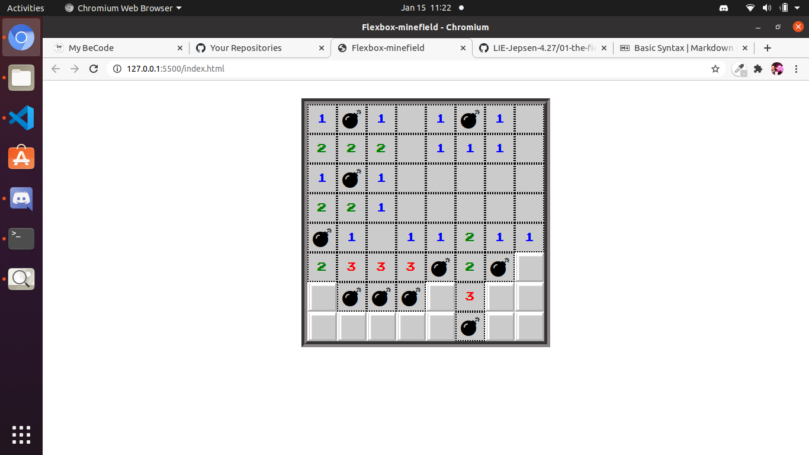

# flexbox-minefield

https://gregdicaro.github.io/flexbox-minefield/.

Moi Greg j ai crée un projet pour la pratique du flexbox

c est une representation du jeu minefield

j ai travaillé sur ce projet du 13 janvier au 15 janvier jusque midi

j etais en teletravail donc chez moi

ca ressemble au jeu du demineur

le projet est terminé

il a ete fait en hmtl css et j ai utilisé la techno flexbox

il est installe avec la propriete display:flex et son vocabulaire

ca vient d un exercice du coach Nico de chez becode
